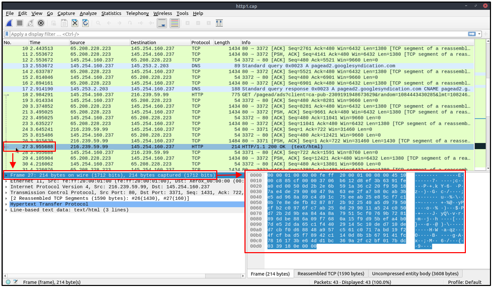
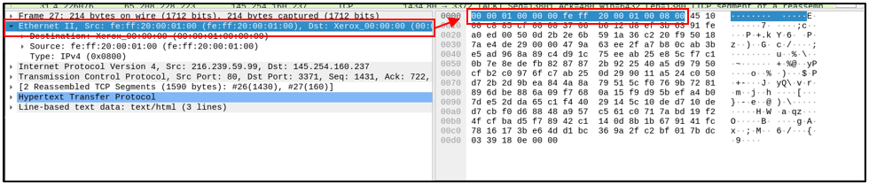
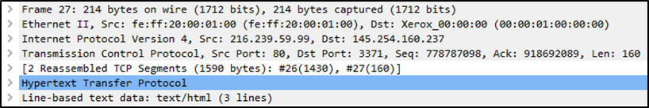
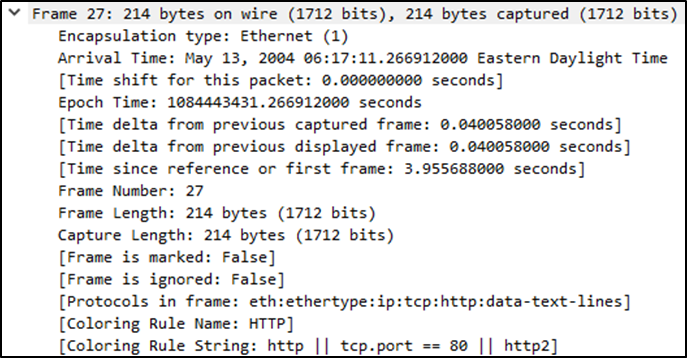
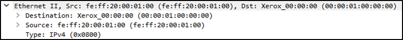
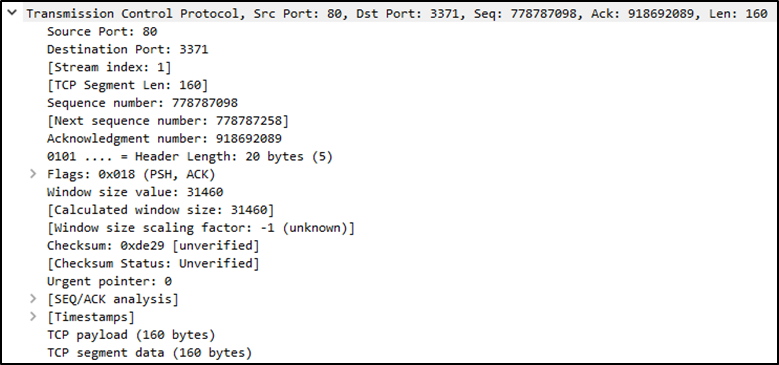
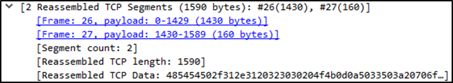
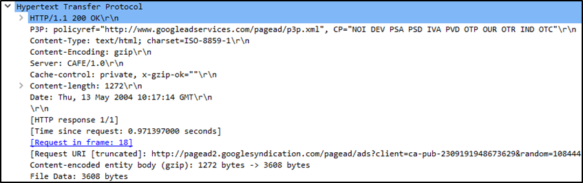
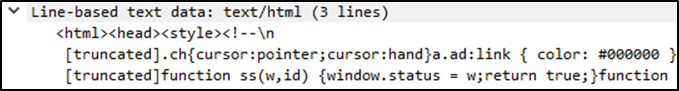

## Packet Dissection

Packet dissection is also know as **protocol dissection,** Which investigates packet details by decoding available protocols and fields. Wireshark supports a long list of protocols for dissection, and you can also write your dissection scripts. here is a link for more info about dissection https://github.com/boundary/wireshark/blob/master/doc/README.dissector

**Note:** This section covers how Wireshark uses OSI layers to break down packets and how to use these layers for analysis. It is expected that you already have background knowledge of the OSI model and how it works.

* * *

## Packet Details

You can click on a packet in the packet list pane to open its details (double-click will open details in a new windows). Packets consist of 5 to 7 layers based on the OSI model.  
We will go over all of them in an HTTP packet from a sample capture. This picture shows example of packet number 27

Each time you click a detail, it will highlight the corresponding part in the packet in the bytes pane (please check part 1 for section names)

Lets take closer look at details pane

* * *

## The Frame (Layer 1)

This will show you what frame/packet you are looking at and details specific to the **Physical layer** of the OSI model  

* * *

## Source \[MAC\] (Layer 2)

This will show the source and destination MAC Addresses; from the **Data Link layer** of the OSI model.  

* * *

## Source \[IP\] (Layer 3)

This will show you the source and destination IPv4 Addresses; from the **Network layer** of the OSI model.  

* * *

## Protocol (Layer 4)

This will show you details of the protocol used (UDP/TCP) and source and destination ports; from the **Transport layer** of the OSI model.   

* * *

## Protocol Errors

This continuation of the 4th layer shows specific segments from TCP that needed to be reassembled.  

* * *

## Application Protocol (Layer 5)

This will show details specific to the protocol used, such as **HTTP**, **FTP**, and **SMB**. from the **Application layer** of the OSI model.  

* * *

## Application Data

This extension of the 5th layer can show the application-specific data.  

&nbsp;