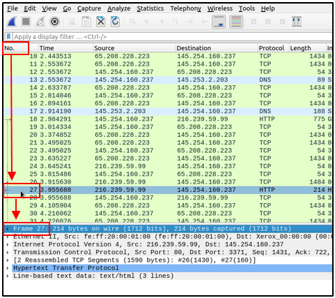
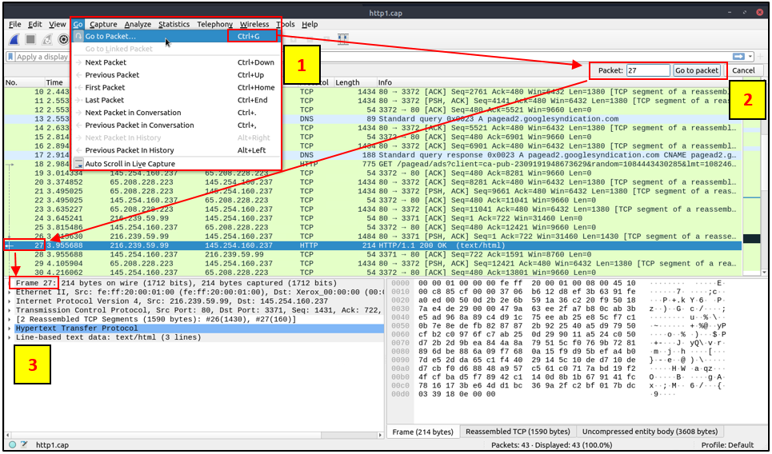
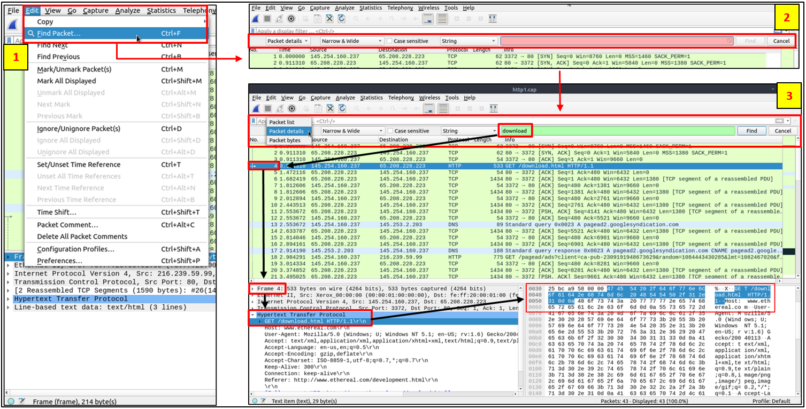
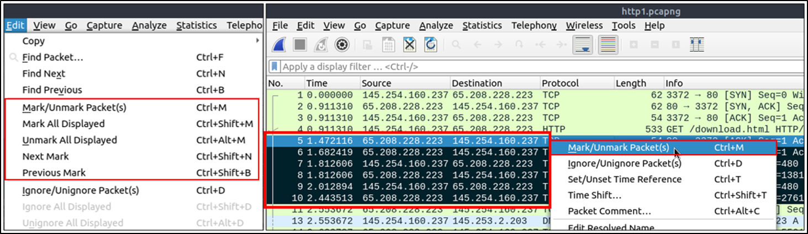
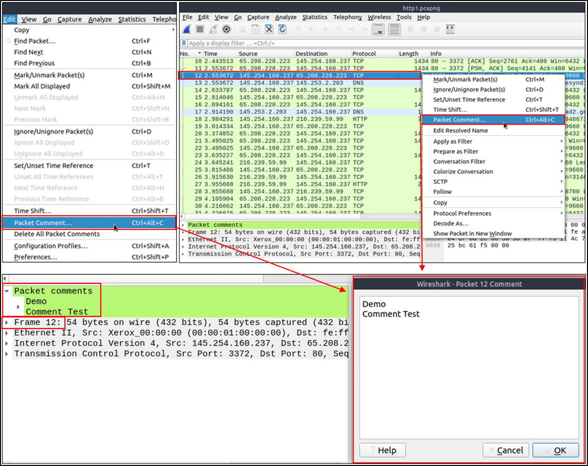
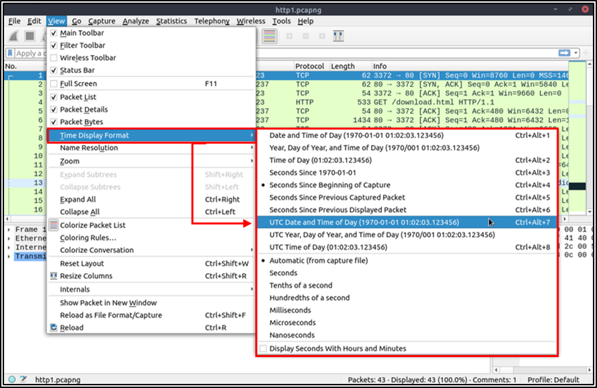
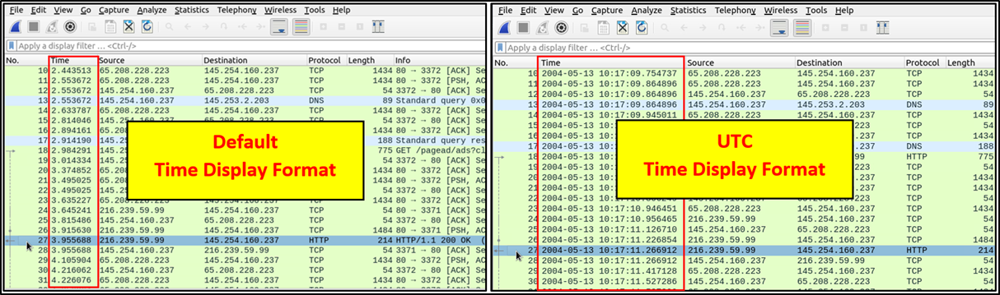
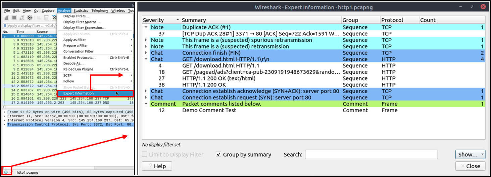

## Packet Numbers

Wireshark calculates the number of investigated packets and assigns a unique number for each packet. This helps the analysis process for big captures and makes it easy to go back to a specific point of an event.  

* * *

## Go to Packet

Packet numbers do not only help to count the total number of packets or make it easier to find/investigate specific packets. This feature not only navigates between packets up and down; it also provides in-frame packet tracking and finds the next packet in the particular part of the conversation. You can use the "**Go"** menu toolbar to view specific packets.   

* * *

## Find Packets

Wireshark can find packets by packet content. You can use the **"Edit --> Find Packet"** menu to make a search inside the packets for a particular event of interest. This helps analyst and administrator to find specific intrusion patterns or failure traces.

There are two crucial points in finding packets.

- The first is knowing the input type. This functionality accepts four types of inputs(Display filter, Hex, String and Regex). String and regex searches are the most commonly used search types. Searches are case insensitive, but you can set the case sensitivity in your search by clicking the radio buttom.
- The second point is choosing the search field. You can conduct searches in the three panes (packet list, packet details, and packet bytes), and it is important to know the available information in each pane to find the event of interest. For example, if you try to find the information available in the packet details pane and conduct the search in the packet list pane, Wireshark won't find it even if it exists.

* * *

## Mark Packets

Marking packets is another helpful functionality for analyst. You can find/point to a specific packet for further investigation by marking it. It helps analysts point to an event of interest or export particular packets from the capture. You can use the **"Edit"** or the "right-click" menu to mark/unmark packets.

Marked packets will be shown in black regardless of the original colour representing the connection type. Note that marked packet information is renewed every file session, so marked packet will be lost after closing the capture file.  

* * *

## Packet Comments

Commenting is another helpful feature for analysts. You can add comments for particular packets that will help the further investigation or remind and point out important/ suspicious points for the other layer analyst. Unlike packet marking, the comments can stay withing the capture file until the operator removes them.  

* * *

## Export Packets

Capture files can contain thousands of packets in a single file. As mentioned earlier, Wireshark is no an IDS, so sometimes, it is necessary to separate specific packages from the file and dig deeper to resolve an incident. This functionality helps analysts share the only suspicious packages (decided scope). Thus redundant information is not included in the analysis process. You can use the "File" menu to export packets.  

* * *

## Time Display Format

Wireshark lists the packets as they are captured, so investigating the default flow is not always the best option. By default, Wireshark shows the time in "Seconds Since Beginning of Capture", the common usage is using UTC time Display Format for a better view.   
You can use the **"View ---> Time Display Format"** menu to change the time display format.  

* * *

## Expert Info

Wireshark also detects specific states of protocol to help analyst easily spot possible anomalies and problems. Note that these are only suggestions, and there is always a chance of having false positives/negatives. Expert info can provide a group of categories in three different severities. Details are shown in the table below.

|     |     |     |
| :---: | --- | :--- |
| **Severity** | **Colour** | **Info** |
| **Chat** | **Blue** | Information on usual workflow. |
| **Note** | **Cyan** | Notable events like application error codes. |
| **Warn** | **Yellow** | Warnings like unusual error codes or problem statements. |
| **Error** | **Red** | Problems like malformed packets. |

Frequently encountered information groups are listed in the table below. You can refer to Wireshark's official documentation for more information on the expert information entries.

|     |     |     |     |
| --- | --- | --- | --- |
| **Group** | **Info** | **Group** | **Info** |
| **Checksum** | Checksum errors. | **Deprecated** | Deprecated protocol usage. |
| **Comment** | Packet comment detection. | **Malformed** | Malformed packet detection. |

You can use the **"lower left bottom section"** in the status bar or **"Analyse ---> Expert Information"** menu to view all available information entries via a dialogue box. It will show the packet number, summary, group protocol and total occurrence.  

&nbsp;