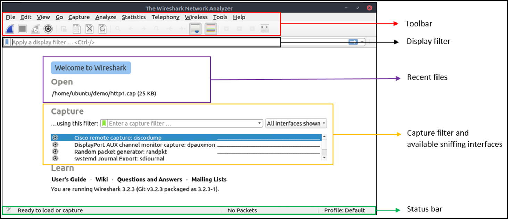
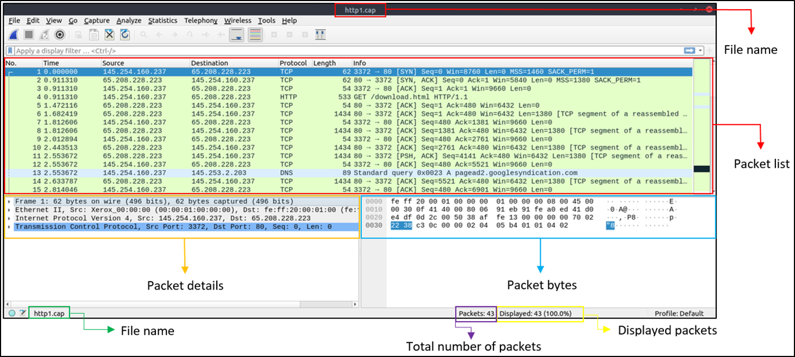
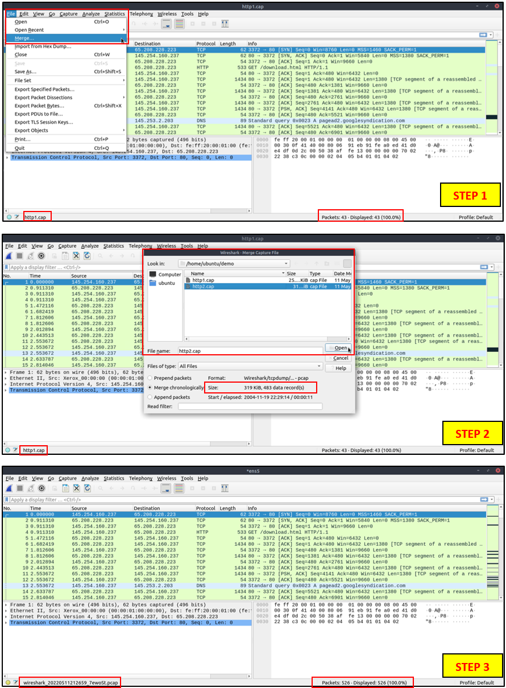

## Use Cases

- Detecting and troubleshooting network problems, such as network load failure points and congestion
- Detecting security anomalies, such as rogue hosts, abnormal port usage, and suspicous traffic.
- investigating and learning protocol details, such as response codes and payload data.  
    **Note** Wireshark is not an Intrusion Detection System (IDS). It only allows analysts to discover and investigate the packets in depth. it also does not modify packets; it read them.

* * *

## GUI and Data

Wireshark GUI opens with a single all-in-one page, which helps users investigate the traffic in multiple ways. at first glance five sections stand out:

| Toolbar | The main toolbar contains multiple menus and shortcuts for packet sniffing and processing, including filtering,  sorting, summarizing, exporting and merging. |
| --- | --- |
| Display Filter Bar | The main query and filtering section. |
| Recent Files | List of the recently investigated files. You can recall listed files with a double-click. |
| Capture Filter and Interfaces | Capture filter and available sniffing points (network interfaces). The network interface is the connection point between a computer and a network. The software connection (e.g., Io, eth0 and ens33) enables networking hardware. |
| Status Bar | Tool status, profile and numeric packet information. |

* * *

## Loading PCAP Files

| Packet List Pane | Summary of each packet (source and destination addresses, protocol, and packet info). You can click on the list to choose packet for further investigation. Once you select a packet, the details will appear in the other panels. |
| --- | --- |
| Packet Details Pane | Detailed protocol breakdown of the selected packet. |
| Packet Bytes Pane | Hex and decoded ASCII representation of the selected packet. It highlights the packet field depending on the clicked section in the details pane. |

* * *

## Coloring Packets

You can create custom color rules to spot events of interest by using display filters.

Wireshark has two types of packet coloring methods: temporary rules that are only available during a program session and permanent rules that are saved under the preference file (profile) and available for the next program session.

\* You can use the "right-click menu" or "**View ---> Coloring Rules**" menu to create permanent coloring rules. The "**Colourise Packet List**" menu activates/deactivates the colouring rules.

\* Temporary packet colouring is done with the "right-click menu" or "**View --> Conversation Filter**" menu 

The default coloring is shown below

* * *

## Traffic Sniffing

You can use the blue "**shark button**" to start network sniffing (capturing traffic), the red button will stop the sniffing, and the green button will restart the sniffing process. The status bar will also provide the used sniffing interface and the number of collected packets.

* * *

## Merge PCAP Files

Wireshark can combine two PCAP files into one single file  
You can use the "**File ---> Merge**" menu path to merge a PCAP with the processed one. when you choose the second file, Wireshark will show the total number of packets in the selected file. Once you click "open", it will merge the existing PCAP file with the chosen on and create a new PCAP file.  
NOTE: you need to save the "merged" PCAP file before working on it.

* * *

## View File Details

Knowing the file details is helpful. Especially when working with multiple PCAP files, sometimes you will need to know and recall the file details (File hash, capture time, capture file comments, interface and statistics) to identify the file, classify and prioritize it.

You can view details by following "Statistics ---> Capture File Properties" or by clicking the "**PCAP icon located on the left bottom**" of the window.

