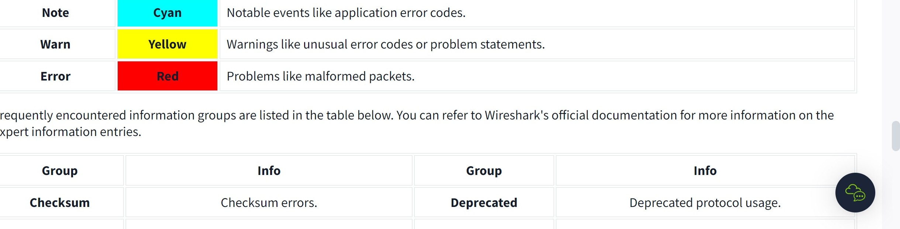

&nbsp;

Go to packet number 39765  
Look at the "packet details pane". Right-click on the JPEG section and "Export packet bytes". This is an alternative way of extracting data from a capture file. What is the MD5 hash value of extracted image?

